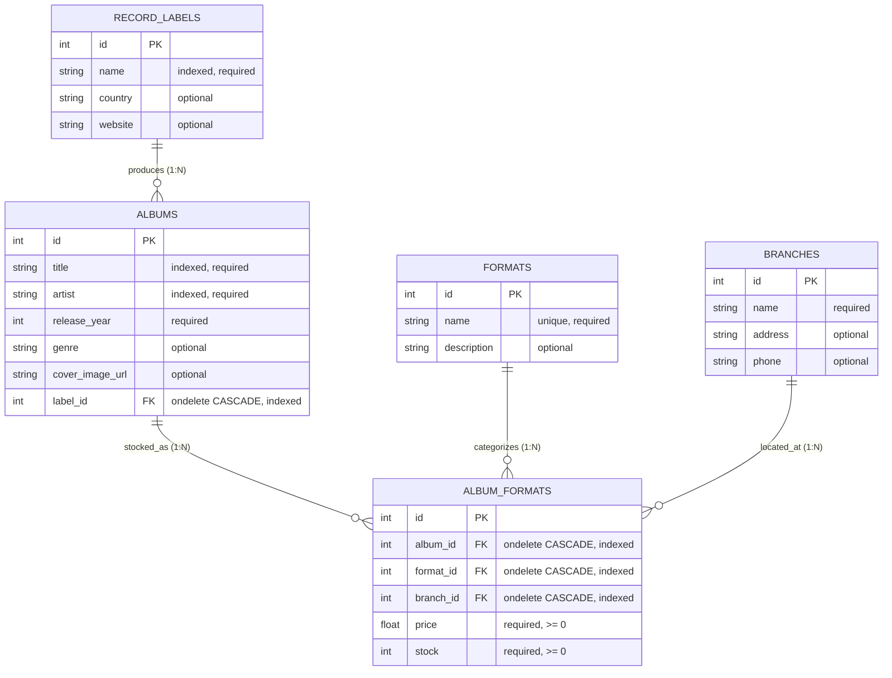
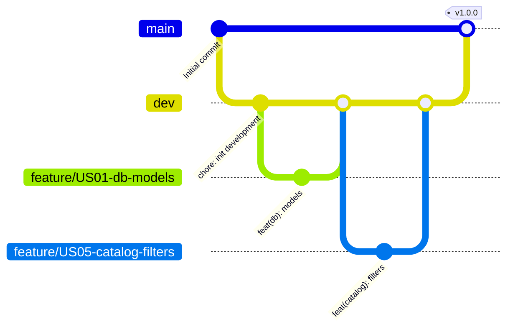

# Palmeras en la Mancha Records — Backend API

[](https://www.python.org/)
[](https://fastapi.tiangolo.com)
[](https://www.sqlalchemy.org/)
[](https://docs.pydantic.dev/)
[](https://docs.pytest.org/)
[](https://coverage.readthedocs.io/)
[](LICENSE)

A production-ready asynchronous RESTful API for **Palmeras en la Mancha Records**, a specialized indie record store network. Built with **FastAPI**, **SQLAlchemy 2.0**, and **Pydantic v2**, this backend manages physical and digital music catalogs, multi-branch store inventories, record labels, format editions, and cloud media storage.

---

## Table of Contents

1. [Overview & Core Features](#overview--core-features)
2. [Tech Stack & Architecture](#tech-stack--architecture)
3. [Database Design (Entity-Relationship Diagram)](#database-design-entity-relationship-diagram)
4. [Project Structure](#project-structure)
5. [Getting Started & Local Installation](#getting-started--local-installation)
6. [API Endpoints Catalog](#api-endpoints-catalog)
7. [API Consumption Examples (cURL & Axios)](#api-consumption-examples-curl--axios)
8. [Testing & Quality Assurance (`pytest --cov`)](#testing--quality-assurance-pytest---cov)
9. [Deployment Configuration (Render & PostgreSQL)](#deployment-configuration-render--postgresql)
10. [Gitflow & Development Guidelines](#gitflow--development-guidelines)

---

## Overview & Core Features

- **Master Entity Management (CRUD)**: Complete lifecycle administration for record labels, physical formats (Vinyl 12", CD, Cassette), and physical branches.
- **N:M Relational Inventory**: Multi-branch stock control linking albums, formats, and physical store locations with composite uniqueness constraints, non-negative price/stock check constraints, and cascade integrity.
- **Dynamic Catalog Query Engine**: Advanced multi-parameter search endpoint (`GET /api/v1/albums`) supporting simultaneous, case-insensitive partial matching (`title`, `artist`, `label_name`, `format_name`), exact identifier filters (`label_id`, `format_id`, `branch_id`), eager loading optimization (`selectinload`), and deduplication (`distinct`).
- **Cloudinary Media Storage**: Asynchronous image upload integration for album artwork with format optimization.
- **Health Diagnostics**: Real-time database probing (`GET /health`) executing `SELECT 1` queries to ensure zero-downtime operational health.
- **Interactive Documentation**: Auto-generated Swagger UI (`/docs`) and ReDoc (`/redoc`) powered by OpenAPI 3.1 metadata.

---

## Tech Stack & Architecture

| Layer | Technology | Details |
| :--- | :--- | :--- |
| **Framework** | [FastAPI](https://fastapi.tiangolo.com/) | Modern async/typed framework, dependency injection, lifespan management |
| **ORM** | [SQLAlchemy 2.0](https://www.sqlalchemy.org/) | Declarative 2.0 mapped columns, relationships, eager joins (`selectinload`, `joinedload`) |
| **Validation** | [Pydantic v2](https://docs.pydantic.dev/) | Strict typed schemas, `from_attributes=True`, `ConfigDict(extra="forbid")` |
| **Database** | [PostgreSQL](https://www.postgresql.org/) / [SQLite](https://www.sqlite.org/) | PostgreSQL on Render (Production), SQLite with `StaticPool` (Testing & local dev) |
| **Media Service** | [Cloudinary SDK](https://cloudinary.com/) | Cloud-hosted cover asset uploads and secure URL delivery |
| **Testing** | [Pytest](https://pytest.org/) & [HTTPX](https://www.python-httpx.org/) | 82 comprehensive unit & integration tests, isolated memory sessions |
| **Coverage** | [pytest-cov](https://pytest-cov.readthedocs.io/) | Automated line coverage verification (87% overall, 100% on routers) |
| **Deployment** | [Render](https://render.com/) | Native Python runtime, automated Git deployments via `render.yaml` & `Procfile` |

---

## Database Design (Entity-Relationship Diagram)

The system models a music catalog distributed across multiple brick-and-mortar stores:



### Constraints & Relational Invariants
- **Composite Uniqueness**: `uq_album_format_branch` ensures that a specific album in a specific format can only have one inventory entry per physical branch.
- **Check Constraints**: `ck_album_formats_price_non_negative` (`price >= 0`) and `ck_album_formats_stock_non_negative` (`stock >= 0`).
- **Referential Integrity**: Cascading deletes (`ondelete="CASCADE"`) guarantee that deleting a format, branch, or album automatically purges orphaned inventory rows.

---

## Project Structure

```text
palmeras-en-la-mancha-records-backend/
├── app/
│   ├── controller/
│   │   ├── album_controller.py     # Dynamic search engine and album business logic
│   │   ├── album_formats_controller.py # Inventory junction queries and validations
│   │   ├── branches_controller.py  # Branch CRUD and relational loader
│   │   ├── formats_controller.py   # Format CRUD operations
│   │   └── record_labels_controller.py # Record label CRUD operations
│   ├── core/
│   │   ├── config.py               # Pydantic BaseSettings, env vars, CORS config
│   │   ├── database.py             # SQLAlchemy engine, sessionmaker, get_db dependency
│   │   └── exceptions.py           # Global exception handlers and error normalization
│   ├── db/
│   │   └── seed.py                 # Idempotent demo catalog seed script
│   ├── models/                     # SQLAlchemy declarative ORM models
│   │   ├── album.py
│   │   ├── album_format.py
│   │   ├── branch.py
│   │   ├── format.py
│   │   └── record_label.py
│   ├── routers/                    # FastAPI route modules (APIRouter)
│   │   ├── album_formats.py        # /api/v1/album-formats
│   │   ├── albums.py               # /api/v1/albums
│   │   ├── branches.py             # /api/v1/branches
│   │   ├── formats.py              # /api/v1/formats
│   │   ├── health.py               # /health
│   │   └── record_labels.py        # /api/v1/record-labels
│   ├── schemas/                    # Pydantic v2 validation and response models
│   │   ├── album.py
│   │   ├── album_filters.py        # Query parameter definitions & validations
│   │   ├── album_format.py
│   │   ├── branch.py
│   │   ├── common.py
│   │   ├── format.py
│   │   └── record_label.py
│   ├── services/
│   │   ├── catalog_query.py        # Query optimization and benchmark utilities
│   │   └── cloudinary_service.py   # Asynchronous Cloudinary image uploader
│   └── main.py                     # FastAPI application factory, lifespan, CORS, mounts
├── tests/                          # Pytest test suites
│   ├── conftest.py                 # In-memory SQLite fixtures, client override
│   ├── test_album_filters.py       # Exhaustive filter permutation & performance tests
│   ├── test_album_formats.py       # Inventory CRUD & cascade integrity tests
│   ├── test_albums.py              # Cloudinary upload and album lifecycle tests
│   ├── test_branches.py            # Physical branch endpoints test battery
│   ├── test_formats.py             # Physical formats test battery
│   ├── test_main.py                # Root and health probe smoke tests
│   └── test_record_labels.py       # Record label CRUD test battery
├── guideline/
│   └── guideline.md                # Project requirements and Agile sprint breakdown
├── Procfile                        # Render process runner definition
├── render.yaml                     # Render infrastructure-as-code deployment manifest
├── requirements.txt                # Production and development dependencies
└── README.md                       # Comprehensive technical documentation
```

---

## Getting Started & Local Installation

### Prerequisites
- **Python**: Version 3.11, 3.12, or 3.13 installed.
- **Git**: Version control client installed.

### 1. Clone the Repository
```bash
git clone https://github.com/DesarrolloWebFullStackIA/palmeras-en-la-mancha-records-backend.git
cd palmeras-en-la-mancha-records-backend
```

### 2. Configure Virtual Environment
```bash
# On Linux / macOS
python3 -m venv .venv
source .venv/bin/activate

# On Windows (PowerShell)
python -m venv .venv
.\.venv\Scripts\Activate.ps1
```

### 3. Install Dependencies
```bash
pip install --upgrade pip
pip install -r requirements.txt
```

### 4. Configure Environment Variables
Create a `.env` file in the project root (or copy from sample):

```env
PROJECT_NAME="Palmeras en la Mancha Records API"
VERSION="1.0.0"
ENVIRONMENT="development"

# Database Configuration (Defaults to local SQLite if omitted)
DATABASE_URL="sqlite:///./palmeras_records.db"

# Cloudinary Media Configuration (Optional for local testing; mocked in tests)
CLOUDINARY_CLOUD_NAME="your_cloud_name"
CLOUDINARY_API_KEY="your_api_key"
CLOUDINARY_API_SECRET="your_api_secret"
CLOUDINARY_FOLDER="palmeras_records_covers"

# CORS Allowed Origins (Comma-separated)
BACKEND_CORS_ORIGINS="http://localhost:3000,http://localhost:5173,http://127.0.0.1:5500,http://localhost:8000"
```

### 5. Seed Initial Catalog Data
Populate the database with realistic indie record labels, formats, branches, albums, and stock:
```bash
python -m app.db.seed
```

### 6. Start the Development Server
```bash
uvicorn app.main:app --reload --host 127.0.0.1 --port 8000
```

Access the interactive API documentation at:
- **Swagger UI**: [http://127.0.0.1:8000/docs](http://127.0.0.1:8000/docs)
- **ReDoc**: [http://127.0.0.1:8000/redoc](http://127.0.0.1:8000/redoc)

---

## API Endpoints Catalog

All catalog and management endpoints are prefixed with `/api/v1`.

### System & Diagnostics

| Method | Endpoint | Description | Status Code |
| :--- | :--- | :--- | :--- |
| `GET` | `/` | API status metadata, version, and documentation links | `200 OK` |
| `GET` | `/health` | Diagnostic probe executing `SELECT 1` on the database | `200 OK` |

### Music Catalog (`/api/v1/albums`)

| Method | Endpoint | Query Parameters | Description | Status Code |
| :--- | :--- | :--- | :--- | :--- |
| `GET` | `/api/v1/albums/` | `title`, `artist`, `label_id`, `label_name`, `format_id`, `format_name`, `branch_id`, `skip`, `limit` | Dynamic catalog query engine with combinable filters and deduplication | `200 OK` |
| `GET` | `/api/v1/albums/{id}` | None | Retrieve detailed album information by primary key | `200 OK`, `404 Not Found` |
| `POST` | `/api/v1/albums/` | Multipart Form: `title`, `artist`, `release_year`, `label_id`, `genre`, `image` | Register new album with optional Cloudinary cover upload | `200 OK`, `404 Not Found` (invalid label) |
| `PUT` | `/api/v1/albums/{id}`| Multipart Form: optional update fields and optional `image` | Modify album metadata and replace cover art | `200 OK`, `404 Not Found` |

### Master Entities

#### Record Labels (`/api/v1/record-labels`)
- `GET /api/v1/record-labels/`: List labels (supports `?include_albums=true`, `?branch_id=...`, `?skip=`, `?limit=`).
- `POST /api/v1/record-labels/`: Create record label (`201 Created`).
- `GET /api/v1/record-labels/{id}`: Retrieve label by ID (`200 OK`, `404 Not Found`).
- `PUT /api/v1/record-labels/{id}`: Update label details (`200 OK`, `404 Not Found`).
- `DELETE /api/v1/record-labels/{id}`: Remove label and cascade delete related albums (`200 OK`, `404 Not Found`).

#### Physical Formats (`/api/v1/formats`)
- `GET /api/v1/formats/`: List formats (supports `?include_albums=true`, `?record_label_id=...`).
- `POST /api/v1/formats/`: Create physical format (`201 Created`, `400 Bad Request` if duplicate).
- `GET /api/v1/formats/{id}`: Retrieve format by ID (`200 OK`, `404 Not Found`).
- `PUT /api/v1/formats/{id}`: Update format details (`200 OK`, `404 Not Found`).
- `DELETE /api/v1/formats/{id}`: Delete format and cascade delete inventory rows (`200 OK`, `404 Not Found`).

#### Store Branches (`/api/v1/branches`)
- `GET /api/v1/branches/`: List physical stores (supports `?include_albums=true`, `?record_label_id=...`).
- `POST /api/v1/branches/`: Create store branch (`201 Created`).
- `GET /api/v1/branches/{id}`: Retrieve store by ID (`200 OK`, `404 Not Found`).
- `PUT /api/v1/branches/{id}`: Update branch contact/address (`200 OK`, `404 Not Found`).
- `DELETE /api/v1/branches/{id}`: Delete branch and cascade delete inventory rows (`200 OK`, `404 Not Found`).

### Inventory Management (`/api/v1/album-formats`)

- `GET /api/v1/album-formats/`: List inventory entries (supports `?album_id=...`, `?format_id=...`, `?branch_id=...`).
- `POST /api/v1/album-formats/`: Create stock line (`201 Created`, `400 Bad Request` on duplicate composite pair or negative stock/price, `404 Not Found` on invalid foreign keys).
- `GET /api/v1/album-formats/{id}`: Get inventory row by ID (`200 OK`, `404 Not Found`).
- `PUT /api/v1/album-formats/{id}`: Update price and stock count (`200 OK`, `404 Not Found`).
- `DELETE /api/v1/album-formats/{id}`: Delete stock line (`204 No Content`, `404 Not Found`).

---

## API Consumption Examples (cURL & Axios)

### 1. System Health Check

#### cURL
```bash
curl -X GET "http://localhost:8000/health" -H "Accept: application/json"
```

#### Axios
```typescript
import axios from 'axios';

const checkHealth = async () => {
  const { data } = await axios.get('http://localhost:8000/health');
  console.log(`System Status: ${data.status}, Database: ${data.database}`);
};
```

---

### 2. Multi-Filter Catalog Search

Search for indie vinyl albums by artist containing "Nirvana" available at branch `1`:

#### cURL
```bash
curl -G "http://localhost:8000/api/v1/albums/" \
  --data-urlencode "artist=Nirvana" \
  --data-urlencode "format_name=Vinyl" \
  --data-urlencode "branch_id=1" \
  -H "Accept: application/json"
```

#### Axios
```typescript
import axios from 'axios';

const searchCatalog = async () => {
  const response = await axios.get('http://localhost:8000/api/v1/albums/', {
    params: {
      artist: 'Nirvana',
      format_name: 'Vinyl',
      branch_id: 1,
      limit: 10,
    },
  });
  console.log('Matching Albums:', response.data);
};
```

---

### 3. Register a Record Label

#### cURL
```bash
curl -X POST "http://localhost:8000/api/v1/record-labels/" \
  -H "Content-Type: application/json" \
  -d '{
    "name": "Sub Pop Records",
    "country": "United States",
    "website": "https://www.subpop.com"
  }'
```

#### Axios
```typescript
import axios from 'axios';

const createLabel = async () => {
  const response = await axios.post('http://localhost:8000/api/v1/record-labels/', {
    name: 'Sub Pop Records',
    country: 'United States',
    website: 'https://www.subpop.com',
  });
  console.log('Created Label ID:', response.data.id);
};
```

---

### 4. Create an Album with Artwork Upload

Upload multipart form data containing album metadata and cover image:

#### cURL
```bash
curl -X POST "http://localhost:8000/api/v1/albums/" \
  -F "title=Bleach" \
  -F "artist=Nirvana" \
  -F "release_year=1989" \
  -F "genre=Grunge" \
  -F "label_id=1" \
  -F "image=@/path/to/cover.jpg;type=image/jpeg"
```

#### Axios
```typescript
import axios from 'axios';

const uploadAlbum = async (imageFile: File) => {
  const formData = new FormData();
  formData.append('title', 'Bleach');
  formData.append('artist', 'Nirvana');
  formData.append('release_year', '1989');
  formData.append('genre', 'Grunge');
  formData.append('label_id', '1');
  formData.append('image', imageFile);

  const response = await axios.post('http://localhost:8000/api/v1/albums/', formData, {
    headers: { 'Content-Type': 'multipart/form-data' },
  });
  console.log('Cover Image URL:', response.data.cover_image_url);
};
```

---

### 5. Add Inventory (Stock & Price) to a Store Branch

#### cURL
```bash
curl -X POST "http://localhost:8000/api/v1/album-formats/" \
  -H "Content-Type: application/json" \
  -d '{
    "album_id": 1,
    "format_id": 1,
    "branch_id": 1,
    "price": 24.99,
    "stock": 15
  }'
```

#### Axios
```typescript
import axios from 'axios';

const addInventoryStock = async () => {
  const response = await axios.post('http://localhost:8000/api/v1/album-formats/', {
    album_id: 1,
    format_id: 1,
    branch_id: 1,
    price: 24.99,
    stock: 15,
  });
  console.log('Inventory Entry Created:', response.data);
};
```

---

## Testing & Quality Assurance (`pytest --cov`)

The test suite provides exhaustive verification across smoke, integration, CRUD, relational cascade, and search query permutation tests.

### Running Tests
Execute the entire test suite:
```bash
pytest
```

Execute tests with detailed terminal code coverage:
```bash
pytest --cov=app --cov-report=term-missing
```

Generate an interactive HTML coverage report:
```bash
pytest --cov=app --cov-report=html
# Open htmlcov/index.html in your browser
```

### Coverage Report Summary

```text
Name                                         Stmts   Miss  Cover
----------------------------------------------------------------
app/controller/album_controller.py              59      0   100%
app/controller/album_formats_controller.py      58     19    67%
app/controller/branches_controller.py           64     20    69%
app/controller/formats_controller.py            64     14    78%
app/controller/record_labels_controller.py      65     19    71%
app/core/config.py                              28      2    93%
app/core/database.py                            22      4    82%
app/core/exceptions.py                          12      1    92%
app/main.py                                     36      6    83%
app/models/album.py                             14      0   100%
app/models/album_format.py                      15      0   100%
app/models/branch.py                            11      0   100%
app/models/format.py                            10      0   100%
app/models/record_label.py                      10      0   100%
app/routers/album_formats.py                    30      0   100%
app/routers/albums.py                           37      0   100%
app/routers/branches.py                         36      0   100%
app/routers/formats.py                          36      0   100%
app/routers/health.py                           10      0   100%
app/routers/record_labels.py                    36      0   100%
app/schemas/album.py                            26      0   100%
app/schemas/album_filters.py                    14      0   100%
app/schemas/album_format.py                     27      0   100%
app/schemas/branch.py                           18      0   100%
app/schemas/common.py                           11      0   100%
app/schemas/format.py                           15      0   100%
app/schemas/record_label.py                     20      0   100%
app/services/catalog_query.py                   18      2    89%
app/services/cloudinary_service.py              11      3    73%
----------------------------------------------------------------
TOTAL                                          847    111    87%
======================== 82 passed in 0.94s ========================
```

### Test Isolation Architecture
- Tests execute against an isolated in-memory SQLite database (`sqlite:///:memory:`) using SQLAlchemy's `StaticPool`.
- `PRAGMA foreign_keys=ON` is strictly enforced to validate relational constraints, cascades, and foreign key integrity.
- `client` fixtures inject database sessions via FastAPI's `app.dependency_overrides[get_db]`.
- Cloudinary network calls are fully mocked via `unittest.mock.AsyncMock`.

---

## Deployment Configuration (Render & PostgreSQL)

The repository includes production deployment configurations for **Render**:

### 1. `render.yaml` Blueprint
The application is declared as an Infrastructure-as-Code service connected to a managed PostgreSQL database instance:
```yaml
services:
  - type: web
    name: palmeras-records-api
    runtime: python
    region: frankfurt
    plan: free
    buildCommand: pip install -r requirements.txt
    startCommand: uvicorn app.main:app --host 0.0.0.0 --port $PORT
    envVars:
      - key: DATABASE_URL
        fromDatabase:
          name: palmeras-records-db
          property: connectionString

databases:
  - name: palmeras-records-db
    plan: free
    region: frankfurt
```

### 2. `Procfile`
```text
web: uvicorn app.main:app --host 0.0.0.0 --port $PORT
```

### 3. URL Compatibility
Render and cloud providers provide PostgreSQL connection strings using the legacy `postgres://` prefix. [app/core/config.py](file:///a:/TRABAJO-SINCRONIZADO/Clases/06-Python/palmeras-en-la-mancha-records-backend/app/core/config.py) automatically validates and translates `postgres://` to `postgresql://` before initializing SQLAlchemy 2.0.

---

## Gitflow & Development Guidelines

This project strictly adheres to **Gitflow** branching rules and Clean Architecture standards:



### Branching Rules
- **`main`**: Production-ready code only. Direct commits are strictly prohibited.
- **`dev`**: Integration branch for completed features and hotfixes.
- **`feature/USXX-...`**: Dedicated feature branch for each User Story task. Commits follow Conventional Commits format.

### Commit Invariants
All commits must be in English following the Conventional Commits specification:
- `feat(scope): ...` for new features or endpoints.
- `fix(scope): ...` for bug fixes or contract alignments.
- `test(scope): ...` for test suites or assertions.
- `docs(scope): ...` for documentation updates.
- `chore(scope): ...` for configuration or scaffolding.

---

## License

This project is licensed under the **MIT License**.
Distributed by Palmeras en la Mancha Records © 2026.